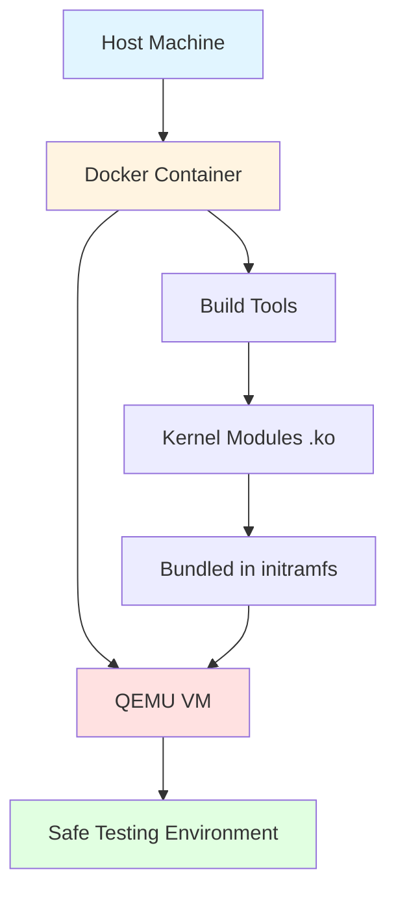
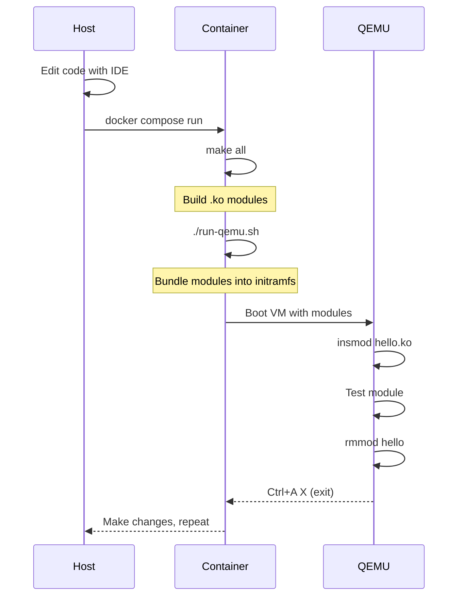
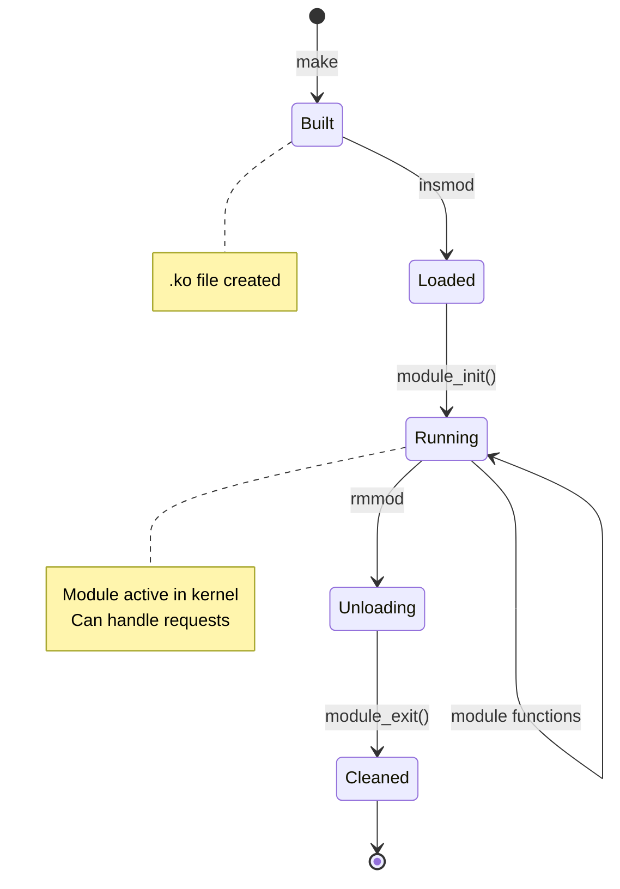

# Linux Device Driver Sandbox

A minimal Docker + QEMU environment for safely developing and testing Linux kernel modules.

**Author:** Federico Roux [rouxfederico@gmail.com]

## Overview

This project provides an isolated sandbox for learning kernel driver development without risking your host system. It uses Docker for building modules and QEMU for testing them in a safe, virtualized environment.

## Architecture



**Key Features:**
- ✅ **Safe testing** - Crashes won't affect your host
- ✅ **Fast builds** - Native compilation in container
- ✅ **Minimal setup** - Single Dockerfile, works out of the box
- ✅ **Version matched** - Module builds for exact QEMU kernel

## Prerequisites

- Docker and Docker Compose
- ~1GB disk space
- (Optional) `/dev/kvm` for faster QEMU

## Quick Start

```bash
# 1. Build the Docker image (first time only, ~2-3 minutes)
docker compose build

# 2. Start container
docker compose run --rm ldd-sandbox bash

# 3. Build a module (inside container)
make all
# or: cd 01-hello-world && make

# 4. Test in QEMU (inside container)
./run-qemu.sh

# 5. Inside QEMU VM
insmod /modules/hello.ko
dmesg | tail
rmmod hello

# 6. Exit QEMU
# Press: Ctrl+A, then X
```

## Workflow

### Development Cycle



1. **Edit** code on host with your favorite editor
2. **Build** in container: `make all`
3. **Test** in QEMU: `./run-qemu.sh`
4. **Iterate** - changes on host are immediately visible in container

### Building Modules

```bash
# Build all modules
make all

# Build specific module
make example ex=01-hello-world

# Clean build artifacts
make clean
```

### Testing in QEMU

The `run-qemu.sh` script automatically:
- Finds the container's kernel
- Bundles your built `.ko` modules into initramfs
- Boots QEMU with modules ready to test

```bash
# Inside container
./run-qemu.sh

# Inside QEMU
ls /modules/              # See available modules
insmod /modules/hello.ko  # Load module
dmesg | tail              # See kernel messages
lsmod                     # List loaded modules
rmmod hello               # Unload module
```

**Exit QEMU:** Press `Ctrl+A`, then `X`

## Background theory around ldd

1. What are Device Drivers?

Device drivers are kernel modules that act as a bridge between hardware devices and the operating system. They translate generic OS commands into device-specific operations.

2. Types of Device Drivers

* **Character Devices:** Accessed as streams of bytes (e.g., serial ports, keyboards)
* **Block Devices:** Accessed in fixed-size blocks (e.g., hard drives, USB sticks)
* **Network Devices:** Handle network packets (e.g., Ethernet cards)

3. Essential Concepts

* **Kernel Space vs User Space:** Drivers run in kernel space with full hardware access
* **Kernel Modules:** Loadable pieces of kernel code (.ko files)
* **Major/Minor Numbers:** Identify devices (major = driver, minor = specific device)


## Tips & Tricks

### Container Shell
```bash
# Get a shell in the container
docker compose run --rm ldd-sandbox bash

# Run specific command
docker compose run --rm ldd-sandbox make all
```

### Kernel Messages
```bash
# Inside QEMU
dmesg                 # All kernel messages
dmesg | tail          # Recent messages
dmesg | grep hello    # Filter messages
dmesg -c              # Clear message buffer
```

### Module Info
```bash
# Inside container (after building)
modinfo 01-hello-world/hello.ko

# Shows: version, description, author, license, parameters
```

### Debugging
```bash
# Inside QEMU - Check if module loaded
lsmod | grep hello

# See module details
cat /proc/modules | grep hello

# Check for errors
dmesg | grep -i error
```

## Common Issues

### "No such device" errors in QEMU
- This is expected - the minimal QEMU environment doesn't have 9p filesystem support
- Modules are bundled into initramfs instead (automatic)

### "BTF generation skipped" warning
- This is normal and can be ignored
- BTF is for advanced debugging/eBPF, not needed for basic drivers

### Build errors
- Make sure you're building inside the container
- Kernel headers version must match the kernel in `/boot`

### QEMU is slow
- Make sure `/dev/kvm` is available on your host
- Check that `devices: - /dev/kvm` is in `compose.yml`

## Module Lifecycle



## Learning Resources

- [Linux Kernel Module Programming Guide](https://tldp.org/LDP/lkmpg/2.6/html/)
- [Linux Device Drivers, 3rd Edition](https://lwn.net/Kernel/LDD3/)
- [Kernel Documentation](https://www.kernel.org/doc/html/latest/)

## Adding New Modules

1. Create a new directory: `mkdir 02-my-driver`
2. Add source in `02-my-driver/src/`
3. Create `02-my-driver/Makefile` (copy from `01-hello-world`)
4. Update root `Makefile`: add `02-my-driver` to `SUBDIRS`
5. Build and test!

## License

See [LICENSE](LICENSE) file.

## Contributing

This is a learning project. Feel free to add more example drivers and submit pull requests!

---

**Happy kernel hacking! 🐧🔧**
